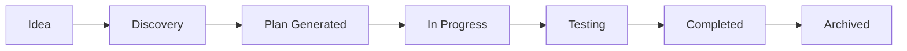

# Feature Implementation Plans

This directory contains detailed implementation plans for new features and enhancements to the Keep Choosing Good application.

## What Are These Files?

Each file in this directory is a comprehensive implementation plan generated by the **Feature Breakdown Skill**. These plans transform feature ideas into actionable, atomic tasks organized into vertical slices.

## File Structure

### Active Plans
Implementation plans currently in progress or ready to implement.

### Example Plans
- `EXAMPLE-favorite-responses-implementation-plan.md` - Example of what a complete plan looks like

### Completed Plans
Plans for features that have been fully implemented (moved here after completion).

## Using These Plans

### For Implementers

1. **Read the Executive Summary** - Understand scope and complexity
2. **Review Acceptance Criteria** - Know what "done" looks like
3. **Understand the Architecture** - See what files are affected
4. **Follow the Vertical Slices** - Implement in order
5. **Use Atomic Tasks** - Convert to Claude todos
6. **Test as You Go** - Validate after each slice

### For Reviewers

1. **Check Acceptance Criteria** - Does the implementation meet all criteria?
2. **Review Architecture Decisions** - Were they followed?
3. **Validate Testing Strategy** - Were all tests executed?
4. **Assess Risk Mitigations** - Were identified risks handled?

### For Product Managers

1. **Executive Summary** - Quick overview
2. **Requirements Summary** - User stories and acceptance criteria
3. **Rollout Plan** - Implementation phases
4. **Success Metrics** - How to measure impact

## Plan Anatomy

Every implementation plan contains:

### 📋 Executive Summary
Quick overview of the feature, problem, scope, and complexity

### ✅ Requirements Summary
- User stories
- Acceptance criteria
- Technical requirements
- Integration points

### 🏗️ Architecture Overview
- Files to modify
- Files to create
- Architectural decisions and rationale

### 📦 Vertical Slices
Independently deliverable chunks of work, each containing:
- Goal and value
- Dependencies
- Atomic tasks with validation criteria

### 🧪 Testing Strategy
Unit, integration, and manual testing checklists

### 🚀 Rollout Plan
Phased implementation approach

### ⚠️ Risk Assessment
Technical and UX risks with mitigations

### 🤖 Agent Assignment Recommendations
Which Claude agents to use for which tasks

### ✓ TodoWrite Format
Tasks formatted for Claude's TodoWrite tool

## Generating New Plans

To create a new implementation plan, use the Feature Breakdown Skill:

```
You: "I want to plan a new feature using the feature breakdown skill"
```

See the [Feature Breakdown Guide](../FEATURE-BREAKDOWN-GUIDE.md) for complete instructions.

## Plan Lifecycle



### Statuses

- **Draft**: Plan is being refined
- **Ready**: Plan is approved and ready for implementation
- **In Progress**: Currently being implemented
- **Testing**: Implementation complete, undergoing testing
- **Completed**: Fully implemented and deployed
- **Archived**: Moved to completed-plans subdirectory

## Best Practices

### ✅ DO:
- Generate a plan before starting significant features
- Review plans with team before implementation
- Update plans if you discover issues during implementation
- Mark plans as completed and move to archive
- Reference plan sections during code review

### ❌ DON'T:
- Start implementation without a plan for medium+ features
- Skip vertical slices or change order without reason
- Ignore testing strategies
- Leave completed plans in the main directory

## Plan Template

If you want to create a plan manually (not recommended, use the skill instead), follow the structure in the EXAMPLE file.

## Questions?

- **How do I generate a plan?** See [FEATURE-BREAKDOWN-GUIDE.md](../FEATURE-BREAKDOWN-GUIDE.md)
- **What's a vertical slice?** A slice delivers end-to-end value independently
- **What's an atomic task?** A specific, testable action with clear validation
- **How do I convert to todos?** Use the TodoWrite format section in each plan

## Related Documentation

- [Feature Breakdown Guide](../FEATURE-BREAKDOWN-GUIDE.md) - Complete guide to using the system
- [CLAUDE.md](../../CLAUDE.md) - Project overview and architecture
- `.claude/skills/feature-breakdown.md` - The skill definition

---

## Current Active Plans

(List active plans here as they're created)

- None yet - generate your first plan!

## Recently Completed

(Move completed plans to `completed-plans/` subdirectory)

- None yet
